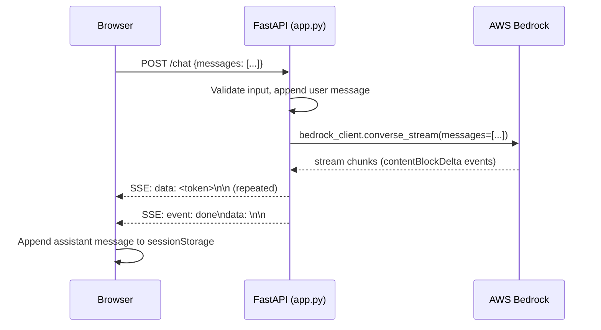
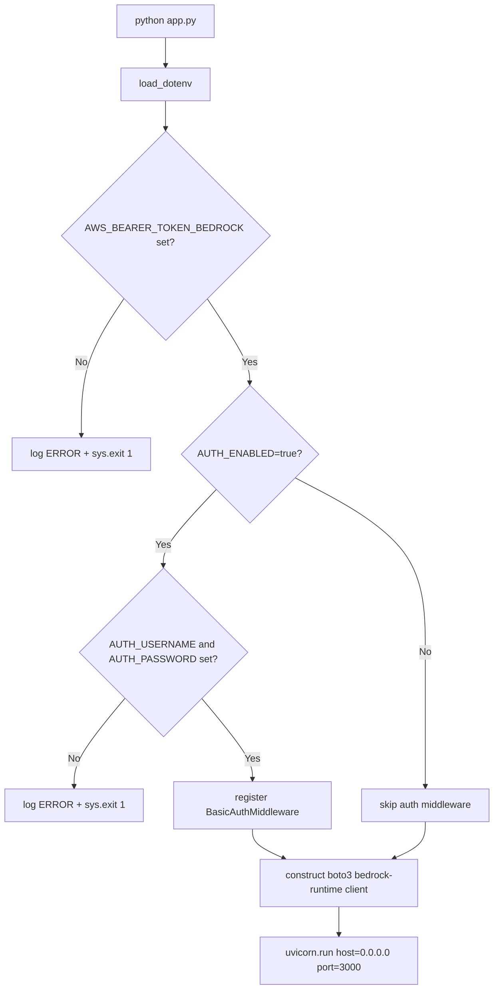

# Design Document: bedrock-chat-app

## Overview

The bedrock-chat-app is a single-file Python web application that provides a ChatGPT-style browser interface for AWS Bedrock's Claude 3.5 Sonnet model. The backend is built on **FastAPI** and streams model responses to the browser via **Server-Sent Events (SSE)**. The frontend is a self-contained HTML/CSS/JS page embedded directly in `app.py` and served as a static response — no build step required.

Key design goals:
- Zero-friction local setup: `pip install -r requirements.txt && python app.py`
- Real-time streaming via SSE so tokens appear as they are generated
- Conversation context maintained in the browser's `sessionStorage` and sent with every request
- Optional HTTP Basic Auth middleware for safe public exposure via tunnels

### Technology Choices

| Concern | Choice | Rationale |
|---|---|---|
| Web framework | FastAPI 0.115.x | Async-native, `StreamingResponse` built-in, minimal boilerplate |
| ASGI server | Uvicorn 0.30.x | Standard FastAPI runtime; supports `0.0.0.0` binding |
| AWS SDK | boto3 1.35.x | Official SDK; `converse_stream` API handles Anthropic Messages format |
| Env loading | python-dotenv 1.0.x | Reads `.env` at startup before boto3 client construction |
| Markdown rendering | marked.js 12.x (CDN) | Lightweight browser-side Markdown parser; no build step |
| Auth | FastAPI `HTTPBasic` + Starlette middleware | Built-in; no extra dependency |

---

## Architecture

The application follows a simple three-layer architecture:

```
Browser (Chat_Interface)
        │  HTTP POST /chat  (JSON body: messages[])
        │  GET  /stream     (SSE: text/event-stream)
        ▼
FastAPI App  (app.py)
        │  boto3 converse_stream
        ▼
AWS Bedrock Runtime  (Claude 3.5 Sonnet)
```

### Request / Response Flow



### Startup Sequence



---

## Components and Interfaces

### 1. `app.py` — Entry Point and Route Definitions

**Responsibilities:**
- Load environment variables via `python-dotenv`
- Validate required env vars at startup; exit with code 1 on failure
- Construct the boto3 `bedrock-runtime` client
- Conditionally register `BasicAuthMiddleware`
- Define HTTP routes
- Serve the embedded HTML page
- Log at INFO/ERROR levels to stdout

**Routes:**

| Method | Path | Description |
|---|---|---|
| `GET` | `/` | Serve the embedded Chat_Interface HTML |
| `POST` | `/chat` | Accept a chat request; return an SSE stream |

### 2. `BedrockClient` (module-level singleton)

Constructed once at startup using:
```python
os.environ["AWS_BEARER_TOKEN_BEDROCK"] = api_key  # set before boto3 import
client = boto3.client("bedrock-runtime", region_name=aws_region)
```

The `AWS_BEARER_TOKEN_BEDROCK` environment variable is the sole credential. boto3's bearer token credential provider picks it up automatically — no `aws_access_key_id` or `aws_secret_access_key` are used.

**Key method — `stream_response(messages: list[dict]) -> AsyncGenerator[str, None]`:**
- Calls `client.converse_stream(modelId=model_id, messages=messages, inferenceConfig={"maxTokens": 8192})`
- Iterates the event stream, yielding `contentBlockDelta` text chunks
- On `ThrottlingException`: yields an SSE error event
- On `ModelErrorException` / other `ClientError`: yields an SSE error event with the reason
- On auth/authz errors (`UnauthorizedException`, `AccessDeniedException`): yields an SSE error event indicating invalid API key

### 3. `POST /chat` Route Handler

```
Input:  ChatRequest { messages: list[Message] }
Output: StreamingResponse (text/event-stream)
```

Processing steps:
1. Log the incoming user message at INFO level
2. Apply conversation history pruning (≤ 100 turns)
3. Log the Bedrock API invocation at INFO level
4. Return a `StreamingResponse` wrapping an async generator that:
   - Calls `BedrockClient.stream_response(messages)`
   - Formats each token as `data: <token>\n\n`
   - On stream end: sends `event: done\ndata: \n\n`
   - On error: sends `event: error\ndata: <message>\n\n`

### 4. `BasicAuthMiddleware` (optional)

A Starlette `BaseHTTPMiddleware` subclass that:
- Is only added to the app when `AUTH_ENABLED=true`
- Reads the `Authorization` header; if absent or not `Basic <b64>`, returns HTTP 401 with `WWW-Authenticate: Basic realm="Bedrock Chat"`
- Decodes the Base64 credentials and compares them case-sensitively against `AUTH_USERNAME` / `AUTH_PASSWORD`
- On mismatch: returns HTTP 401
- On match: calls `await call_next(request)`

### 5. Chat_Interface (Embedded HTML/JS)

Served as a raw string from `GET /`. Key responsibilities:

| Concern | Implementation |
|---|---|
| Conversation state | `sessionStorage` — persists through refresh, clears on tab close |
| Message rendering | `marked.parse(text)` via marked.js CDN |
| Streaming | `EventSource` connected to `/chat` via a POST-initiated SSE pattern (using `fetch` + `ReadableStream` reader) |
| Input handling | `keydown` listener: Enter (no Shift) submits; Shift+Enter inserts newline |
| Loading indicator | Animated dots shown after submit; hidden on first token or error |
| New Chat | Cancels in-flight `AbortController`, clears `sessionStorage`, resets UI |
| History pruning notice | Displayed as a system message when the backend prunes history |

> **Note on SSE + POST**: The native `EventSource` API only supports GET. The frontend uses `fetch()` with a `ReadableStream` reader to POST the message list and consume the SSE-formatted response body. This is the standard pattern for chat streaming in modern browsers.

---

## Data Models

### `Message`

```python
class Message(BaseModel):
    role: Literal["user", "assistant"]
    content: str
```

### `ChatRequest`

```python
class ChatRequest(BaseModel):
    messages: list[Message]
```

Validation rules:
- `messages` must be non-empty
- The last message must have `role == "user"`
- Each `content` field must be a non-empty string (whitespace-only rejected)

### SSE Event Format

All SSE events sent from the server follow this format:

| Event type | Wire format |
|---|---|
| Token chunk | `data: <token text>\n\n` |
| Stream complete | `event: done\ndata: \n\n` |
| Error | `event: error\ndata: <human-readable message>\n\n` |

### Conversation History (Browser-side)

Stored in `sessionStorage` as a JSON array of `Message` objects:

```json
[
  { "role": "user",      "content": "Hello" },
  { "role": "assistant", "content": "Hi there!" }
]
```

The frontend sends the full array on every request. The backend applies the 100-turn pruning rule before forwarding to Bedrock.

### Environment Variables

| Variable | Required | Default | Description |
|---|---|---|---|
| `AWS_BEARER_TOKEN_BEDROCK` | Yes | — | ABSK-format API key for Bedrock |
| `AWS_REGION` | No | `us-east-1` | AWS region for the Bedrock endpoint |
| `BEDROCK_MODEL_ID` | No | `anthropic.claude-3-5-sonnet-20241022-v2:0` | Model identifier |
| `AUTH_ENABLED` | No | `false` | Enable HTTP Basic Auth when `true` |
| `AUTH_USERNAME` | Cond. | — | Required when `AUTH_ENABLED=true` |
| `AUTH_PASSWORD` | Cond. | — | Required when `AUTH_ENABLED=true` |

---

## Correctness Properties

*A property is a characteristic or behavior that should hold true across all valid executions of a system — essentially, a formal statement about what the system should do. Properties serve as the bridge between human-readable specifications and machine-verifiable correctness guarantees.*


### Property 1: Input field cleared after any valid submission

*For any* non-empty, non-whitespace message string submitted via the Chat_Interface, the text input field value SHALL be empty immediately after submission.

**Validates: Requirements 3.6**

---

### Property 2: Whitespace-only messages are rejected

*For any* string composed entirely of whitespace characters (spaces, tabs, newlines, or any combination), submitting it SHALL be rejected — the message list SHALL remain unchanged and no request SHALL be sent to the backend.

**Validates: Requirements 3.11**

---

### Property 3: Markdown rendering produces correct HTML elements

*For any* message string containing Markdown syntax (bold `**text**`, italic `*text*`, inline code `` `code` ``, fenced code blocks, or bullet lists), the rendered output SHALL contain the corresponding HTML elements (`<strong>`, `<em>`, `<code>`, `<pre>`, `<ul>/<li>`).

**Validates: Requirements 3.8**

---

### Property 4: SSE stream faithfully forwards all Bedrock tokens and errors

*For any* sequence of text tokens returned by the Bedrock client, each token SHALL appear as a `data:` SSE event in the response stream in the same order. *For any* error raised by the Bedrock client (throttling, service error, or auth error), the SSE stream SHALL contain exactly one `event: error` event with a non-empty human-readable message.

**Validates: Requirements 4.2, 4.5, 6.5, 6.6, 6.7**

---

### Property 5: Conversation history round-trip integrity

*For any* user message submitted to the `/chat` endpoint, that message SHALL appear in the `messages` array forwarded to the Bedrock client. *For any* complete assistant response, after the stream ends the browser's `sessionStorage` history SHALL contain that response as an `assistant` role entry.

**Validates: Requirements 5.2, 5.3**

---

### Property 6: Conversation history pruning preserves recency and enforces the 100-turn cap

*For any* conversation history with N > 100 turns (user/assistant pairs), after pruning the resulting history SHALL have at most 100 turns AND SHALL contain the most recent turns in their original order.

**Validates: Requirements 5.5**

---

### Property 7: Failed Bedrock responses do not mutate conversation history

*For any* Bedrock error or stream interruption, the conversation history after the failed request SHALL be byte-for-byte identical to the history immediately before the request was made.

**Validates: Requirements 5.6**

---

### Property 8: max_tokens is always within the valid range

*For any* invocation of the Bedrock client, the `inferenceConfig.maxTokens` value in the request SHALL satisfy `4096 ≤ maxTokens ≤ 8192`.

**Validates: Requirements 6.4**

---

### Property 9: Auth middleware rejects any request without valid credentials

*For any* HTTP request to any route when `AUTH_ENABLED=true`, if the request does not include an `Authorization: Basic <b64>` header whose decoded value exactly matches (case-sensitive) the configured `AUTH_USERNAME:AUTH_PASSWORD`, the response SHALL be HTTP 401 with a `WWW-Authenticate: Basic realm="Bedrock Chat"` header.

**Validates: Requirements 7.1, 7.3**

---

### Property 10: INFO log entry for every user message and Bedrock invocation

*For any* user message submitted to the `/chat` endpoint, the application log SHALL contain at least one INFO-level entry that references the message content, and at least one INFO-level entry that records the Bedrock API invocation.

**Validates: Requirements 8.5**

---

### Property 11: Handled errors produce HTTP 500 and an ERROR log entry

*For any* handled error condition raised during request processing, the HTTP response status SHALL be 500 AND the application log SHALL contain an ERROR-level entry that includes the error type and error message.

**Validates: Requirements 8.6**

---

## Error Handling

### Startup Errors (fatal — process exits with code 1)

| Condition | Behavior |
|---|---|
| `AWS_BEARER_TOKEN_BEDROCK` absent or empty | Log `ERROR: AWS_BEARER_TOKEN_BEDROCK is not set or empty` → `sys.exit(1)` |
| `AUTH_ENABLED=true` and `AUTH_USERNAME` absent/empty | Log `ERROR: AUTH_USERNAME is not set or empty` → `sys.exit(1)` |
| `AUTH_ENABLED=true` and `AUTH_PASSWORD` absent/empty | Log `ERROR: AUTH_PASSWORD is not set or empty` → `sys.exit(1)` |

### Runtime Errors (returned as SSE error events)

| Condition | SSE payload |
|---|---|
| `ThrottlingException` from Bedrock | `event: error\ndata: Request throttled by AWS Bedrock. Please try again.\n\n` |
| `UnauthorizedException` / `AccessDeniedException` | `event: error\ndata: Invalid or unauthorized API key. Check AWS_BEARER_TOKEN_BEDROCK.\n\n` |
| Other `ClientError` | `event: error\ndata: Bedrock service error: <reason>\n\n` |
| Unexpected exception in route handler | Log full stack trace at ERROR; return HTTP 500 JSON `{"detail": "Internal server error"}` |

### Client-Side Error Handling

| Condition | UI behavior |
|---|---|
| `event: error` received | Display error text in conversation as a system message; re-enable input |
| No first token within 30 seconds | Dismiss loading indicator; display "Response timed out" error message; re-enable input |
| SSE connection drops without `event: done` | Display "Connection lost" error message; re-enable input |

---

## Testing Strategy

### Dual Testing Approach

The testing strategy combines **unit/example-based tests** for specific behaviors and **property-based tests** for universal invariants.

### Property-Based Testing Library

**Hypothesis** (Python) is the chosen PBT library.

```
hypothesis==6.112.0
```

Each property test is configured with `@settings(max_examples=100)` and tagged with a comment referencing the design property.

Tag format: `# Feature: bedrock-chat-app, Property <N>: <property_text>`

### Unit / Example Tests

These cover startup validation, specific API behaviors, and edge cases:

- Startup exits with code 1 when `AWS_BEARER_TOKEN_BEDROCK` is missing or empty
- Startup exits with code 1 when `AUTH_ENABLED=true` and auth credentials are missing
- Default values for `AWS_REGION` and `BEDROCK_MODEL_ID` are applied correctly
- `GET /` returns HTML with status 200
- `POST /chat` with an empty messages list returns HTTP 422
- `POST /chat` with the last message not being `role=user` returns HTTP 422
- SSE stream ends with `event: done` after a successful mock response
- `event: error` is sent for `ThrottlingException`, `UnauthorizedException`, and generic `ClientError`
- New Chat clears `sessionStorage` and resets the UI
- Pruning notice is displayed when history exceeds 100 turns
- `AUTH_ENABLED=false` allows unauthenticated access to all routes

### Property Tests (Hypothesis)

| Property | Hypothesis strategy |
|---|---|
| P1: Input cleared after submission | `st.text(min_size=1).filter(lambda s: s.strip())` |
| P2: Whitespace rejected | `st.text(alphabet=st.characters(whitelist_categories=("Zs", "Cc")), min_size=1)` |
| P3: Markdown renders correct HTML | `st.sampled_from(["**bold**", "*italic*", "`code`", "- item"])` combined with `st.text()` |
| P4: SSE forwards tokens and errors | `st.lists(st.text(min_size=1), min_size=1)` for tokens; `st.sampled_from([ThrottlingException, ClientError])` for errors |
| P5: History round-trip | `st.text(min_size=1).filter(lambda s: s.strip())` for message content |
| P6: Pruning preserves recency | `st.integers(min_value=101, max_value=500)` for history length |
| P7: Failed response doesn't mutate history | `st.sampled_from([ThrottlingException, ClientError, ConnectionError])` |
| P8: max_tokens in range | Verify on every mock invocation |
| P9: Auth rejects invalid credentials | `st.text()` for username/password pairs that don't match configured values |
| P10: INFO log for every message | `st.text(min_size=1).filter(lambda s: s.strip())` |
| P11: Handled errors → HTTP 500 + ERROR log | `st.sampled_from` of known error types |

### Integration Tests

These verify end-to-end wiring with a real (or localstack-mocked) Bedrock endpoint:

- Full chat round-trip: submit a message, receive a streamed response, verify history is updated
- Auth middleware blocks unauthenticated requests when `AUTH_ENABLED=true`
- Server binds to `0.0.0.0:3000` and responds to requests on that interface

### Test File Structure

```
tests/
├── test_startup.py          # Startup validation (unit)
├── test_routes.py           # Route handler unit tests with mocked Bedrock
├── test_auth.py             # Auth middleware unit + property tests
├── test_history.py          # Conversation history unit + property tests
├── test_streaming.py        # SSE streaming unit + property tests
├── test_markdown.py         # Markdown rendering property tests (JS via pytest-playwright or pure Python)
└── test_integration.py      # End-to-end integration tests
```
