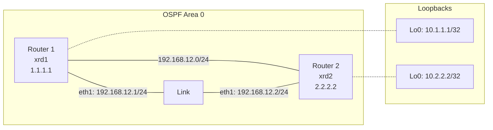

# Practical Guide: Setting Up Containerlab with Two Cisco Routers Running OSPF

This guide provides step-by-step instructions for installing containerlab from GitHub and configuring a basic topology with two Cisco routers running OSPF.

## Table of Contents
1. [Installing Containerlab from GitHub](#installing-containerlab-from-github)
2. [Creating a Basic Topology with Two Cisco Routers](#creating-a-basic-topology-with-two-cisco-routers)
3. [Configuring OSPF on the Routers](#configuring-ospf-on-the-routers)
4. [Deploying and Verifying the Lab](#deploying-and-verifying-the-lab)
5. [Troubleshooting Common Issues](#troubleshooting-common-issues)

## Installing Containerlab from GitHub

### Prerequisites
- Linux operating system (Ubuntu 20.04+ recommended)
- Docker installed and configured
- Git installed
- sudo privileges

### Installation Steps

1. **Clone the containerlab repository**:
   ```bash
   git clone https://github.com/srl-labs/containerlab.git
   cd containerlab
   ```

2. **Build and install containerlab**:
   ```bash
   # Install Go (if not already installed)
   sudo apt update
   sudo apt install -y golang-go

   # Build containerlab
   make build

   # Install containerlab
   sudo make install
   ```

3. **Verify the installation**:
   ```bash
   containerlab version
   ```

## Creating a Basic Topology with Two Cisco Routers

For this example, we'll use Cisco XRd routers, which are containerized versions of Cisco IOS XR.

### Topology Overview

```
+-------+                   +-------+
|       |eth1      eth1     |       |
| xrd1  +-------------------+ xrd2  |
|       |192.168.12.1/24    |       |
+-------+             192.168.12.2/24+-------+
```

### Network Diagram



### Create the Topology File

Create a file named `ospf-lab.yml` with the following content:

```yaml
name: ospf-lab

topology:
  nodes:
    xrd1:
      kind: cisco_xrd
      image: vrnetlab/vr-xrv9k:latest
      mgmt-ipv4: 172.20.20.11

    xrd2:
      kind: cisco_xrd
      image: vrnetlab/vr-xrv9k:latest
      mgmt-ipv4: 172.20.20.12

  links:
    - endpoints: ["xrd1:eth1", "xrd2:eth1"]
```

> **Note**: If you don't have access to Cisco XRd images, you can use alternative router images like FRRouting (FRR) for testing:
> 
> ```yaml
> name: ospf-lab
> 
> topology:
>   nodes:
>     router1:
>       kind: linux
>       image: frrouting/frr:latest
>       mgmt-ipv4: 172.20.20.11
>       binds:
>         - daemons:/etc/frr/daemons
> 
>     router2:
>       kind: linux
>       image: frrouting/frr:latest
>       mgmt-ipv4: 172.20.20.12
>       binds:
>         - daemons:/etc/frr/daemons
> 
>   links:
>     - endpoints: ["router1:eth1", "router2:eth1"]
> ```

## Configuring OSPF on the Routers

### For Cisco XRd Routers

1. **Deploy the lab**:
   ```bash
   sudo containerlab deploy -t ospf-lab.yml
   ```

2. **Configure the first router (xrd1)**:
   ```bash
   # Connect to the router
   docker exec -it clab-ospf-lab-xrd1 /bin/bash
   
   # Enter XR configuration mode
   xr
   
   # Configure interfaces and OSPF
   configure
   interface GigabitEthernet0/0/0/1
     ipv4 address 192.168.12.1 255.255.255.0
     no shutdown
     exit
   
   router ospf 1
     router-id 1.1.1.1
     area 0
       interface GigabitEthernet0/0/0/1
         network point-to-point
         exit
       exit
     exit
   
   commit
   exit
   ```

3. **Configure the second router (xrd2)**:
   ```bash
   # Connect to the router
   docker exec -it clab-ospf-lab-xrd2 /bin/bash
   
   # Enter XR configuration mode
   xr
   
   # Configure interfaces and OSPF
   configure
   interface GigabitEthernet0/0/0/1
     ipv4 address 192.168.12.2 255.255.255.0
     no shutdown
     exit
   
   router ospf 1
     router-id 2.2.2.2
     area 0
       interface GigabitEthernet0/0/0/1
         network point-to-point
         exit
       exit
     exit
   
   commit
   exit
   ```

### Alternative: For FRRouting (FRR) Containers

If you're using FRR containers instead of Cisco XRd:

1. **Create a `daemons` file to enable OSPF**:
   ```bash
   echo "ospfd=yes" > daemons
   ```

2. **Deploy the lab**:
   ```bash
   sudo containerlab deploy -t ospf-lab.yml
   ```

3. **Configure the first router (router1)**:
   ```bash
   # Connect to the router
   docker exec -it clab-ospf-lab-router1 vtysh
   
   # Configure interfaces and OSPF
   configure terminal
   interface eth1
     ip address 192.168.12.1/24
     no shutdown
     exit
   
   router ospf
     ospf router-id 1.1.1.1
     network 192.168.12.0/24 area 0
     exit
   
   write memory
   exit
   ```

4. **Configure the second router (router2)**:
   ```bash
   # Connect to the router
   docker exec -it clab-ospf-lab-router2 vtysh
   
   # Configure interfaces and OSPF
   configure terminal
   interface eth1
     ip address 192.168.12.2/24
     no shutdown
     exit
   
   router ospf
     ospf router-id 2.2.2.2
     network 192.168.12.0/24 area 0
     exit
   
   write memory
   exit
   ```

## Deploying and Verifying the Lab

### Verify OSPF Adjacency

1. **On the first router (xrd1 or router1)**:
   
   For Cisco XRd:
   ```bash
   docker exec -it clab-ospf-lab-xrd1 /bin/bash
   xr
   show ospf neighbor
   show ospf interface brief
   show route ospf
   ```
   
   For FRR:
   ```bash
   docker exec -it clab-ospf-lab-router1 vtysh -c "show ip ospf neighbor"
   docker exec -it clab-ospf-lab-router1 vtysh -c "show ip ospf interface"
   docker exec -it clab-ospf-lab-router1 vtysh -c "show ip route ospf"
   ```

2. **On the second router (xrd2 or router2)**:
   
   For Cisco XRd:
   ```bash
   docker exec -it clab-ospf-lab-xrd2 /bin/bash
   xr
   show ospf neighbor
   show ospf interface brief
   show route ospf
   ```
   
   For FRR:
   ```bash
   docker exec -it clab-ospf-lab-router2 vtysh -c "show ip ospf neighbor"
   docker exec -it clab-ospf-lab-router2 vtysh -c "show ip ospf interface"
   docker exec -it clab-ospf-lab-router2 vtysh -c "show ip route ospf"
   ```

### Expected Output

When OSPF is properly configured, you should see output similar to this:

For Cisco XRd:
```
RP/0/RP0/CPU0:xrd1#show ospf neighbor
Neighbors for OSPF 1

Neighbor ID     Pri   State           Dead Time   Address         Interface
2.2.2.2         1     FULL/  -        00:00:36    192.168.12.2    GigabitEthernet0/0/0/1
```

For FRR:
```
router1# show ip ospf neighbor
Neighbor ID     Pri State           Dead Time Address         Interface            RXmtL RqstL DBsmL
2.2.2.2           1 Full/DR           38.997s 192.168.12.2    eth1:192.168.12.1        0     0     0
```

### Test Connectivity

1. **Add loopback interfaces for testing**:
   
   For Cisco XRd (on xrd1):
   ```bash
   docker exec -it clab-ospf-lab-xrd1 /bin/bash
   xr
   configure
   interface Loopback0
     ipv4 address 10.1.1.1 255.255.255.255
     exit
   router ospf 1
     area 0
       interface Loopback0
         exit
       exit
     exit
   commit
   exit
   ```
   
   For Cisco XRd (on xrd2):
   ```bash
   docker exec -it clab-ospf-lab-xrd2 /bin/bash
   xr
   configure
   interface Loopback0
     ipv4 address 10.2.2.2 255.255.255.255
     exit
   router ospf 1
     area 0
       interface Loopback0
         exit
       exit
     exit
   commit
   exit
   ```

2. **Verify connectivity**:
   
   For Cisco XRd:
   ```bash
   docker exec -it clab-ospf-lab-xrd1 /bin/bash
   xr
   ping 10.2.2.2
   ```

   Expected output:
   ```
   Type escape sequence to abort.
   Sending 5, 100-byte ICMP Echos to 10.2.2.2, timeout is 2 seconds:
   !!!!!
   Success rate is 100 percent (5/5), round-trip min/avg/max = 1/1/2 ms
   ```

## Troubleshooting Common Issues

### Issue: Containers fail to start

**Solution**:
- Check Docker service status: `systemctl status docker`
- Ensure you have enough resources (CPU, RAM)
- Check Docker logs: `docker logs clab-ospf-lab-xrd1`

### Issue: OSPF adjacency doesn't form

**Solution**:
- Verify interface configurations: `show ip interface brief`
- Check OSPF configurations: `show running-config router ospf`
- Ensure network types match on both sides
- Verify IP addresses are in the same subnet
- Check for MTU mismatches between interfaces

### Issue: Unable to ping between routers

**Solution**:
- Check interface status: `show ip interface brief`
- Verify routing table: `show ip route`
- Check for ACLs or firewall rules
- Ensure OSPF is properly advertising routes

### Issue: "Permission denied" errors

**Solution**:
- Run containerlab with sudo
- Check file permissions for topology files
- Ensure Docker socket permissions are correct

### Common OSPF Troubleshooting Commands

For Cisco XRd:
```bash
show ospf
show ospf interface
show ospf neighbor detail
show ospf database
show log | include OSPF
```

For FRR:
```bash
show ip ospf
show ip ospf interface
show ip ospf neighbor detail
show ip ospf database
show log | grep ospf
```

## Cleaning Up

To destroy the lab and clean up all resources:

```bash
sudo containerlab destroy -t ospf-lab.yml
```

## Additional Resources

- [Containerlab Documentation](https://containerlab.dev/)
- [Containerlab GitHub Repository](https://github.com/srl-labs/containerlab)
- [Cisco IOS XR Configuration Guide](https://www.cisco.com/c/en/us/td/docs/iosxr/cisco8000/routing/73x/b-routing-cg-cisco8000-73x/implementing-ospf.html)
- [FRRouting Documentation](https://docs.frrouting.org/)
- [OSPF Protocol RFC 2328](https://datatracker.ietf.org/doc/html/rfc2328)